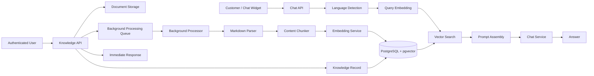
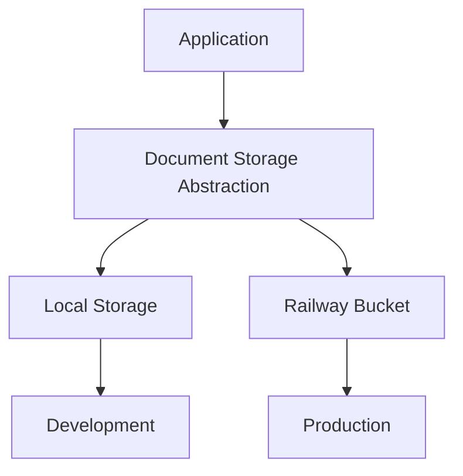
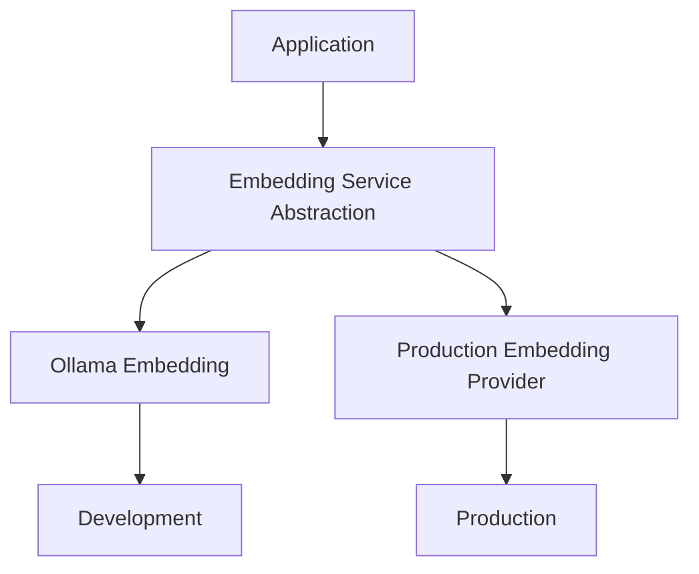
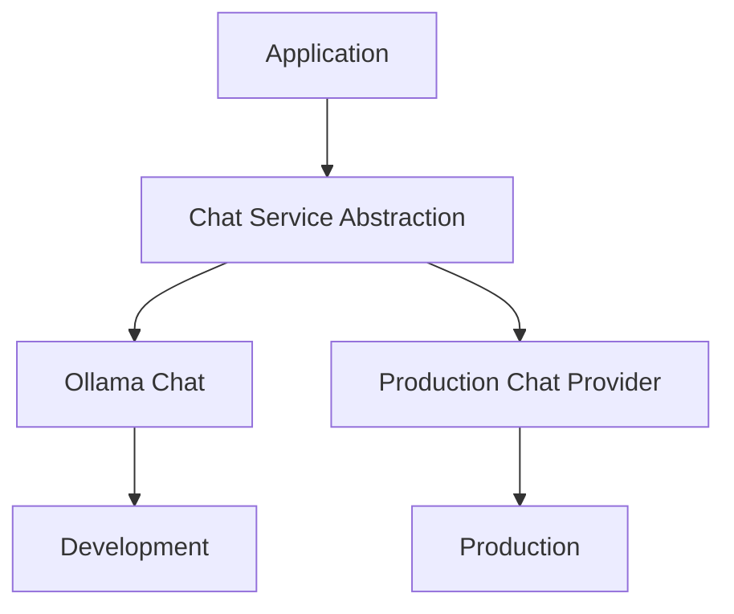
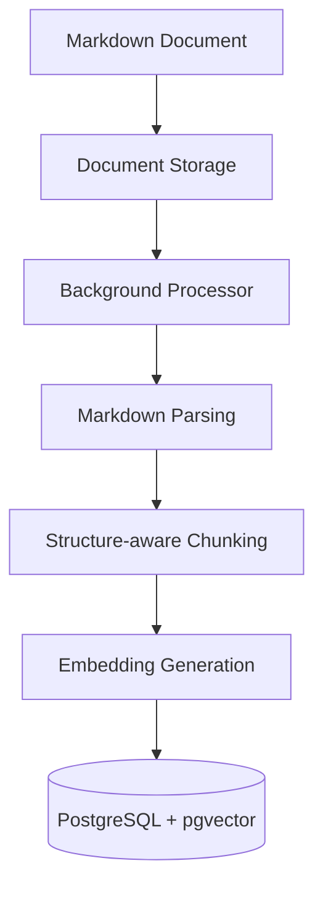
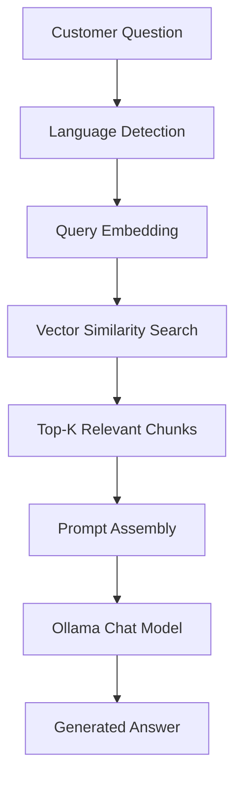
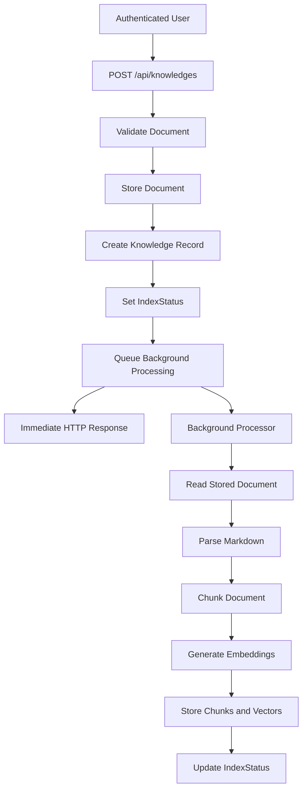

# Customer Support Plateform

A self-hosted, bilingual (EN/TR) RAG customer support platform built for Systek Bilişim.

The platform allows organizations to upload their own documentation and expose that knowledge through an embeddable customer-support chat interface. Documents are stored, processed asynchronously, chunked, embedded, and indexed in PostgreSQL with `pgvector`. Customer questions are answered using retrieved knowledge and a locally hosted LLM through Ollama.

The current implementation is primarily designed for local development and validation. Infrastructure boundaries are abstracted through interfaces so that production-oriented implementations, such as Railway Bucket storage or alternative AI providers, can be introduced without coupling the application workflow to a specific infrastructure provider.


## Table of contents

* [Overview](#overview)
* [Architecture](#architecture)
* [RAG pipeline](#rag-pipeline)
* [Asynchronous document ingestion](#asynchronous-document-ingestion)
* [Tech stack](#tech-stack)
* [Projects in this repo](#projects-in-this-repo)
* [Getting started](#getting-started)
* [Configuration](#configuration)
* [API reference](#api-reference)
* [Bilingual support](#bilingual-support)
* [Infrastructure abstractions](#infrastructure-abstractions)
* [Known limitations](#known-limitations)
* [Roadmap](#roadmap)
* [License](#license)

## Overview

Support teams often answer the same questions from the same service documentation repeatedly. This platform provides a way to turn an organization's documentation into a searchable knowledge base that can be queried through a customer-facing chat interface.

The platform currently supports:

* Bilingual knowledge documents in English and Turkish.
* Markdown document ingestion.
* Structure-aware document chunking.
* Asynchronous document processing.
* Local embedding generation.
* PostgreSQL vector storage through `pgvector`.
* Semantic similarity search.
* Context-aware response generation through Ollama.
* Chat sessions.
* An embeddable JavaScript chat widget.
* Local document storage for development.
* Infrastructure abstractions for production storage and AI-service implementations.
* Authentication for protected API operations.

The current development environment runs the complete RAG pipeline locally. Embeddings and chat completion are performed through Ollama, while document vectors and metadata are stored in PostgreSQL.

## Architecture

The platform separates application workflows from infrastructure-specific implementations through service abstractions.

Document ingestion is asynchronous: uploading a document does not require the client to wait for chunking and embedding generation to finish. The API accepts the document, persists the required information, schedules background processing, and immediately returns a response.



### Application boundaries

The application does not directly depend on a specific document-storage provider, embedding provider, or chat model provider.







The local implementations are currently used because they can be fully integrated and tested in the available development environment.

Production-specific implementations are intentionally not included until they can be properly integrated and validated in the target deployment environment.

## RAG pipeline

The document ingestion pipeline follows:



The customer question pipeline follows:



Each uploaded document contains a `Language` field. During retrieval, the vector search is filtered to the same language as the incoming question.

This prevents the model from unnecessarily receiving documents in a different language and reduces the need for runtime translation.

### Document chunking

Documents are Markdown-based and are processed according to their document structure.

Instead of relying exclusively on fixed-size token windows, the chunking process uses Markdown heading boundaries to preserve semantic sections.

For example:

```text
Cybersecurity Strategy
    |
    +-- Overview
    +-- Benefits
    +-- Implementation
```

A section such as `Cybersecurity Strategy — Benefits` can therefore remain together instead of being arbitrarily split in the middle of a concept.

Each generated chunk is enriched with document and section context before embedding so that retrieved chunks retain information about their original location.

### Vector retrieval

The generated embeddings are stored in PostgreSQL using the `pgvector` extension.

When a customer submits a question:

1. The question is converted into an embedding.
2. The embedding is compared with stored document embeddings.
3. The most relevant chunks are selected using vector similarity.
4. Retrieved chunks are provided to the chat model as contextual information.
5. The model generates the final answer.

## Asynchronous document ingestion

Document ingestion is processed asynchronously so that users do not have to wait for chunking and embedding generation before receiving a response.

When a user uploads a document through:

```http
POST /api/knowledges
```

the API performs the initial upload workflow and schedules the ingestion work for the background processor.

The high-level workflow is:



The background processor performs the resource-intensive operations independently from the HTTP request:

1. Reads the stored document.
2. Parses the Markdown content.
3. Splits the document into semantic chunks.
4. Generates embeddings for the chunks.
5. Stores the chunks and their vectors in PostgreSQL.
6. Updates the document's `IndexStatus`.

### Checking ingestion status

The client can retrieve the document using:

```http
GET /api/knowledges/{id}
```

The returned document information includes `IndexStatus`, which allows the client to determine the current state of the indexing process.

This separates the concepts of:

* **Document upload** — the document has been accepted and stored.
* **Document indexing** — the document has been processed and its chunks and embeddings have been generated.
* **Document availability for retrieval** — the indexing process has completed successfully.

As a result, the upload endpoint remains responsive even when embedding generation or other ingestion operations take significant time.

## Tech stack

| Layer                       | Technology                     |
| --------------------------- | ------------------------------ |
| Backend API                 | .NET 9, ASP.NET Core, Carter   |
| Application orchestration   | ConduitR / CQRS                 |
| Data access                 | Entity Framework Core          |
| Database                    | PostgreSQL                     |
| Vector search               | pgvector                       |
| LLM inference               | Ollama                         |
| Chat model                  | qwen3                          |
| Embedding model             | nomic-embed-text               |
| Markdown parsing            | Markdig                        |
| Text processing             | Semantic Kernel `TextChunker`  |
| Background processing       | Background processor           |
| Chat widget                 | Vanilla JavaScript             |
| Widget isolation            | Shadow DOM                     |
| Containerization            | Docker Compose                 |
| Production document storage | Railway Bucket adapter planned |
| License                     | MIT                            |

## Projects in this repo

```text
├── .github/                        # CI workflows
├── infrastructure/                 # Docker Compose and infrastructure configuration
├── samples/                        # Standalone embeddable chat widget and demo page
│   ├── chatbot-widget.js
│   ├── content.js
│   ├── script.js
│   ├── style.css
│   └── index.html
├── src/                            # Backend API and application implementation
├── CustomerSupportPlateform.slnx
└── README.md
```

### `src`

The backend owns the main application workflow, including:

* Authentication and self-registration.
* Knowledge document ingestion.
* Document storage.
* Markdown parsing and chunking.
* Background document processing.
* Embedding generation.
* Vector persistence.
* Semantic retrieval.
* Chat sessions.
* Chat completion.
* API endpoints.

The backend is exposed through Carter minimal API endpoints and application workflows are orchestrated through MediatR.

### `samples`

The `samples` directory contains the customer-facing chat widget.

The widget can be embedded into another website using a single JavaScript `<script>` tag.

It uses Shadow DOM to isolate its styles and components from the host website.

Open:

```text
samples/index.html
```

for a local demonstration.

### `infrastructure`

The `infrastructure` directory contains the local infrastructure configuration, including Docker Compose configuration for the services required by the application.

## Getting started

### Prerequisites

Install:

* .NET 9 SDK
* Docker Desktop
* Ollama
* PostgreSQL with the `pgvector` extension

For GPU acceleration, configure Docker/Ollama according to your local hardware.

### 1. Pull the required Ollama models

```bash
ollama pull qwen3:1.7b
ollama pull nomic-embed-text
```

The chat model can be changed according to the available hardware.

For CPU-bound environments, a smaller model is recommended. Systems with suitable GPU acceleration can use a larger model.

### 2. Start infrastructure

```bash
docker compose up -d
```

This starts the local infrastructure required by the application.

If you are running Ollama without an NVIDIA GPU, remove the GPU reservation configuration from the Docker Compose file if required by your environment.

### 3. Apply database migrations

From the project directory:

```bash
cd src
dotnet ef database update
```

### 4. Run the API

```bash
dotnet run --project src
```

The API will start using the configured ASP.NET Core environment and port.

### 5. Open the API documentation

Once the API is running, open the generated Swagger/OpenAPI interface from the configured application URL.

The current API exposes four main application endpoints:

```text
POST /api/knowledges
GET  /api/knowledges/{id}
POST /api/sessions
POST /api/chat
```

### 6. Try the widget

Open:

```text
samples/index.html
```

and configure its API URL to point to the running backend.

### 7. Upload a document

The current implementation requires document upload through the API.

The endpoint is:

```http
POST /api/knowledges
```

The API accepts the document and schedules the ingestion workflow for background processing.

The upload operation does not wait for chunking and embedding generation to finish.

Use:

```http
GET /api/knowledges/{id}
```

to inspect the document and its current `IndexStatus`.

## Configuration

The main configuration is located in:

```text
src/appsettings.json
```

Example:

```json
{
  "Ollama": {
    "Endpoint": "http://localhost:11434",
    "ChatModel": "qwen3:1.7b",
    "EmbeddingModel": "nomic-embed-text:latest"
  },
  "ConnectionStrings": {
    "DefaultConnection": "Host=localhost;Database=customer_support;Username=postgres;Password=..."
  }
}
```

The exact model can be changed according to the hardware available for the deployment.

### Secrets

Credentials and other secrets should not be committed to source control.

For local development, use:

```bash
dotnet user-secrets
```

For production, use the deployment platform's environment variables or an appropriate secret-management solution.

Examples of values that should be kept outside source control include:

* Database credentials.
* API keys.
* Authentication secrets.
* External storage credentials.
* Future AI provider credentials.

## API reference

The current backend exposes four main application endpoints.

| Method | Route                  | Authentication     | Purpose                                                        |
| ------ | ---------------------- | ------------------ | -------------------------------------------------------------- |
| `POST` | `/api/knowledges`      | Authenticated user | Upload and asynchronously ingest a knowledge document          |
| `GET`  | `/api/knowledges/{id}` | Authenticated user | Retrieve a specific knowledge document and its indexing status |
| `POST` | `/api/sessions`        | Authenticated user | Create a chat session                                          |
| `POST` | `/api/chat`            | Public             | Submit a question and receive a generated answer               |

### `POST /api/knowledges`

Uploads a Markdown knowledge document.

The endpoint performs the initial document operation and schedules the ingestion workflow for background processing.

The background processor subsequently performs:

1. Document parsing.
2. Structure-aware chunking.
3. Embedding generation.
4. Vector persistence.
5. Index status update.

At the current stage, any authenticated account can access this endpoint because role-based authorization has not yet been implemented.

### `GET /api/knowledges/{id}`

Retrieves information about a specific knowledge document.

The response includes the document's current `IndexStatus`, allowing clients to determine whether the document has completed the ingestion process.

The current API does not provide a collection endpoint such as:

```http
GET /api/knowledges
```

Consequently, there is currently no API operation that exposes all uploaded documents in a single response.

### `POST /api/sessions`

Creates a chat session.

Sessions provide the basis for associating chat interactions with a conversation context.

A complete administration interface for managing sessions and conversations is not currently available.

### `POST /api/chat`

Accepts a customer question and executes the RAG workflow.

The endpoint:

1. Detects the language of the question.
2. Generates an embedding for the question.
3. Searches the vector database.
4. Retrieves the most relevant document chunks.
5. Builds the model prompt.
6. Sends the prompt to the configured chat service.
7. Returns the generated answer.

The endpoint is intentionally public so that anonymous visitors can use the customer-support widget.

Rate limiting, API-key protection, and client-level usage controls have not yet been implemented.

## Bilingual support

The platform currently supports:

* English (`en`)
* Turkish (`tr`)

Each `KnowledgeDocument` contains a language value that is assigned during document ingestion.

Incoming questions are analyzed to determine their language.

The current language detector uses a lightweight heuristic based primarily on Turkish-specific characters:

```text
ç, ğ, ı, ö, ş, ü
```

Vector retrieval is then restricted to documents and chunks belonging to the detected language.

The system prompt also instructs the chat model to respond in the language used by the customer.

Internal retrieval metadata such as document and section identifiers should not be exposed as part of the visible customer response.

## Infrastructure abstractions

A central design goal of the project is to avoid coupling application logic directly to infrastructure providers.

### Document storage

The current development implementation stores uploaded documents locally under the API's data directory.

The application interacts with document storage through an abstraction:


The local implementation is suitable for development because the complete document upload and background-ingestion workflow can be tested without requiring external object storage.

A Railway Bucket implementation can be introduced behind the same abstraction for production deployment.

### Embedding service

Embedding generation is also abstracted from the application workflow:


The current implementation uses Ollama with `nomic-embed-text`.

A production embedding provider can be introduced behind the same service boundary when it can be properly integrated and tested.

### Chat model provider

Chat completion is similarly isolated behind a service abstraction:


The current implementation uses Ollama with the configured `qwen3` model.

A production-specific provider implementation is intentionally deferred until it can be integrated and validated in the target deployment environment.

This approach avoids maintaining production code paths that cannot currently be tested.

## Known limitations

The current version focuses on validating the core RAG workflow, bilingual retrieval, asynchronous document ingestion, authentication, chat sessions, and the embeddable customer-support widget.

Several security, administration, and production-readiness features are intentionally not yet implemented.

### Authentication and authorization

* **Self-registration is enabled.** Users can create their own accounts without an administrator invitation.
* **No role-based access control is implemented.** The system currently does not distinguish between administrators and regular users.
* **All authenticated users can upload documents.** There is currently no authorization rule restricting document ingestion to administrators or designated knowledge-base managers.
* **No role assignment workflow exists.** Users cannot currently be assigned roles through an administration interface.
* **No user-management interface exists.** Account activation, deactivation, role management, and other administrative operations are not currently exposed through a dedicated UI.

### Document management

* **No document listing endpoint exists.** The API currently exposes individual document retrieval but does not provide `GET /api/knowledges` for listing all uploaded documents.
* **No document administration interface exists.** Documents cannot currently be managed through a dedicated administrator dashboard.
* **No document ownership model is implemented.** Uploaded documents become part of the shared knowledge base rather than being associated with individual users.
* **Local storage is currently used.** Uploaded files are stored under the API's local data directory in the development implementation.
* **Production object storage is not yet implemented.** A storage abstraction exists so that Railway Bucket storage can be introduced as a production adapter.

### Chat API security

* **The `/api/chat` endpoint is publicly accessible.** Authentication is not required because the endpoint is intended to support anonymous visitors through the embeddable widget.
* **No API-key mechanism is implemented for the chat endpoint.**
* **No rate limiting is implemented.** A public endpoint can potentially receive an unrestricted number of requests.
* **No quota or usage management is implemented.** The system does not currently enforce per-user, per-client, or per-IP inference limits.
* **No client registration mechanism exists for embedded widgets.** The API currently does not distinguish between different websites consuming the chat endpoint.

### CORS

The current CORS policy is intentionally permissive:

```csharp
builder.Services.AddCors(options =>
{
    options.AddPolicy("ChatWidget", policy =>
    {
        policy.AllowAnyOrigin()
            .WithMethods("POST")
            .WithHeaders("Content-Type");
    });
});
```

This allows the widget to communicate with the API from different websites during development and testing.

For a production deployment, the policy should be restricted to explicitly trusted origins.

### Administration

* **No administration interface exists.** User and document management currently require direct API or infrastructure interaction.
* **No administrator role is currently enforced.**
* **No role assignment interface exists.**
* **No centralized document management workflow exists.**
* **No centralized user-management workflow exists.**

### AI service implementations

* **The current chat implementation uses local Ollama.** A production-specific chat provider implementation has not yet been added.
* **The current embedding implementation uses local Ollama.** A production-specific embedding provider implementation has not yet been added.
* **Production AI implementations are intentionally deferred until they can be properly tested.** The project avoids introducing deployment-specific implementations that cannot be validated in the current development environment.

### RAG and inference

* **Language detection is heuristic, not exhaustive.** Very short Turkish questions without Turkish-specific characters may be classified as English.
* **No streaming responses yet.** The widget waits for the generated response instead of receiving tokens incrementally.
* **CPU-bound inference can be slow.** Response time depends heavily on the selected model, prompt size, retrieved context, and available hardware.
* **No automated RAG evaluation framework is currently implemented.** Retrieval relevance and answer quality are not yet evaluated through a dedicated benchmark or evaluation pipeline.

These limitations describe the current internship implementation and should not be interpreted as architectural constraints. Several of them are intended future improvements enabled by the existing service abstractions and modular boundaries.

## Roadmap

### Security and access control

* [ ] Introduce administrator and regular-user roles.
* [ ] Implement role-based authorization.
* [ ] Restrict document upload to authorized users.
* [ ] Add administrator-controlled user registration/invitation.
* [ ] Add user activation/deactivation.
* [ ] Add API-key or client authentication for production widget deployments.
* [ ] Add rate limiting to `/api/chat`.
* [ ] Add usage/quota management.
* [ ] Restrict CORS to trusted production origins.

### Document management

* [ ] Add `GET /api/knowledges` for document listing.
* [ ] Add document deletion.
* [ ] Add document update/re-ingestion.
* [ ] Add document management through an administration interface.
* [ ] Implement Railway Bucket storage.
* [ ] Add document ownership and/or authorization rules.

### Administration

* [ ] Build an administration dashboard.
* [ ] Add user management.
* [ ] Add role assignment.
* [ ] Add document management.
* [ ] Add basic system usage information.
* [ ] Add chat/session management where appropriate.

### Chat and RAG

* [ ] Implement streaming chat responses through SSE.
* [ ] Improve language detection.
* [ ] Add conversation transcript persistence.
* [ ] Add retrieval evaluation.
* [ ] Add answer-quality evaluation.
* [ ] Improve retrieval strategies beyond basic vector similarity.
* [ ] Add configurable production chat-service adapters.
* [ ] Add configurable production embedding-service adapters.

### Infrastructure

* [x] Implement Railway Bucket storage adapter.
* [ ] Validate the production storage workflow.
* [ ] Validate production AI-service implementations.
* [ ] Add production deployment documentation.
* [ ] Add production security configuration.
* [ ] Provide a CORS-locked widget deployment configuration.

